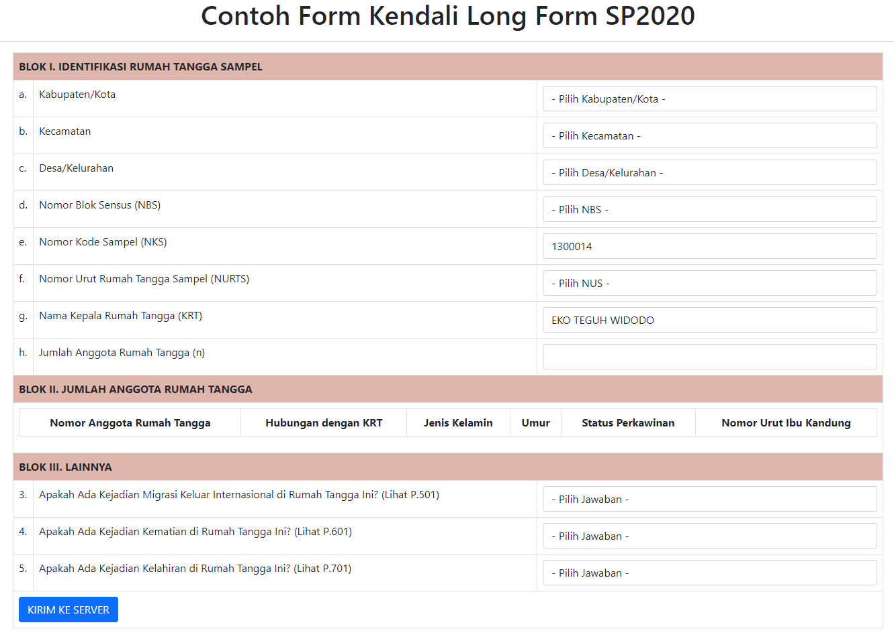

# Form Kartu Kendali Long Form SP2020

Berikut ini adalah implementasi sederhana tampilan dari Kartu Kendali untuk kegiatan Long Form SP2020 (SP2020 Lanjutan). Untuk mengecek hasilnya, bisa `inspect` element dan buka console. Ketika diklik `KIRIM KE SERVER`, datanya dalam bentuk `JSON` sehingga bisa diimplementasikan dengan API.

Untuk informasi terkait `IDENTITAS RUMAH TANGGA SAMPEL`, bisa menggunakan database tiap wilayah, disesuaikan kode programnya.

Untuk implementasi jumlah ART di blok II, sesuai dengan jumlah anggota rumah tangga yang ada pada rincian 1h.

Semoga bermanfaat!

